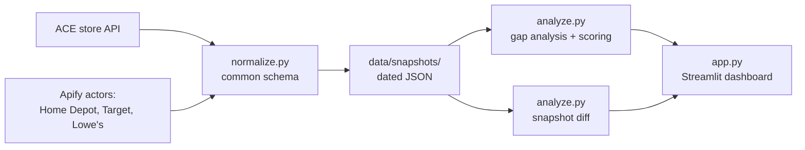

# ShelfSpace

Compare a local hardware store's products with Home Depot, Target, and Lowe's. See what the store is missing and what changed since last month.

![1st Place — ACE Hardware x Apify Hackathon](https://img.shields.io/badge/1st_Place-ACE_Hardware_x_Apify_Hackathon-FF3B3B?style=for-the-badge&labelColor=0D1117&logo=data%3Aimage%2Fsvg%2Bxml%3Bbase64%2CPHN2ZyB3aWR0aD0iMTA4MCIgaGVpZ2h0PSIxMDgwIiB2aWV3Qm94PSIwIDAgMTA4MCAxMDgwIiBmaWxsPSJub25lIiB4bWxucz0iaHR0cDovL3d3dy53My5vcmcvMjAwMC9zdmciPjxwYXRoIGZpbGw9IiNGRkZGRkYiIGQ9Ik02MDcuODU5IDc4LjIyMThIOTg3Ljc4NUM5OTUuNTEzIDc4LjIyMTggMTAwMS43OCA4NC40ODY4IDEwMDEuNzggOTIuMjE1MVY2NzIuODM0QzEwMDEuNzggNjg2Ljc0MiA5ODMuNjkgNjkyLjEzNCA5NzYuMDc1IDY4MC40OTZMNTk2LjE1IDk5Ljg3N0M1OTAuMDYgOTAuNTcwMyA1OTYuNzM3IDc4LjIyMTggNjA3Ljg1OSA3OC4yMjE4WiIgLz48cGF0aCBmaWxsPSIjRkZGRkZGIiBkPSJNNDcyLjE0MSA3OC4yMjE4SDkyLjIxNUM4NC40ODY3IDc4LjIyMTggNzguMjIxNyA4NC40ODY4IDc4LjIyMTcgOTIuMjE1MVY2NzIuODM0Qzc4LjIyMTcgNjg2Ljc0MiA5Ni4zMDk0IDY5Mi4xMzQgMTAzLjkyNCA2ODAuNDk2TDQ4My44NSA5OS44NzdDNDg5Ljk0IDkwLjU3MDMgNDgzLjI2MyA3OC4yMjE4IDQ3Mi4xNDEgNzguMjIxOFoiIC8%2BPHBhdGggZmlsbD0iI0ZGRkZGRiIgZD0iTTUzMy40OTEgNTQzLjA4NkwxMDEuODk1IDk3Ny45MjdDOTMuMTMwMiA5ODYuNzU4IDk5LjM4NDkgMTAwMS43OCAxMTEuODI2IDEwMDEuNzhIOTY4LjUyOUM5ODAuOTE5IDEwMDEuNzggOTg3LjE5NyA5ODYuODYzIDk3OC41MzUgOTc4LjAwM0w1NTMuNDI5IDU0My4xNjFDNTQ3Ljk2OSA1MzcuNTc2IDUzOC45OTMgNTM3LjU0MiA1MzMuNDkxIDU0My4wODZaIiAvPjwvc3ZnPg%3D%3D)

Jerry's Ace Hardware #17892 in Denver needs a simple way to track competitors' products and prices. ShelfSpace regularly collects catalogs from large retailers and compares them with Jerry's catalog. A Streamlit dashboard shows a ranked list of products to stock and a monthly change report.

## What it does

- **Four data sources** — each run collects Jerry's store-specific ACE catalog through the acehardware.com search API. It also collects Home Depot, Target, and Lowe's data with Apify actors: `rigelbytes/homedepot-scraper`, `automation-lab/target-scraper`, and `automation-lab/google-shopping-scraper` filtered to Lowe's.
- **Gap analysis** — converts all data to one product format, matches brand variations such as Rust-Oleum and "rustoleum," and finds competitor brands that Jerry's does not carry.
- **Ranked recommendations** — scores missing products by bestseller badges, ratings, review count, and the number of competitors that carry them. It also combines duplicate products from different stores.
- **Monthly changes** — saves each run as a dated file in `data/snapshots/`. It compares each snapshot with the previous one to find added products, removed products, and price changes of at least 5%. Results go in `data/diffs/`.
- **Dashboard** — provides five tabs: Jerry's Inventory, Gaps & Recommendations, Competitor Catalog, Changes, and Scraped Data. You can filter by category or competitor, switch snapshots, and export recommendations as a PDF.
- **Cost limits** — sets an Apify budget for each run, with a $5 default. It tracks costs and stops actors that exceed spending or item limits. It retries the Home Depot actor up to three times because Akamai bot protection can make it unreliable.

## How it works



`run_snapshot.py` starts the pipeline. It runs single batch calls for Target and Lowe's and a category search for Home Depot. These tasks run in parallel. The script then standardizes the results, saves the day's snapshot, prints ranked recommendations, and compares the data with the previous snapshot when available.

The dashboard reads the saved snapshots. A sidebar button can run the full pipeline again with your chosen budget and product limit.

`scrape_all.py` is an alternative data collector. It gets the same categories through SerpAPI, using Google Shopping and Home Depot's native search, and calls Target's Redsky API directly. Use it when bot protection blocks the Apify actors.

## Tech stack

- **Python** — standard-library `urllib` for direct store APIs and `ThreadPoolExecutor` for parallel collection
- **Apify** (`apify-client`) — competitor catalog actors and residential proxies
- **Streamlit** — dashboard with custom CSS and a light theme
- **ReportLab** — PDF export of recommendations
- **SerpAPI** — optional fallback data source
- **Storage** — dated JSON snapshot files; no database required

## Run it locally

```bash
pip install -r requirements.txt

# .env (gitignored) — keys are read via python-dotenv, never hardcoded
APIFY_TOKEN=...        # required for Home Depot / Target / Lowe's scraping
TARGET_REDSKY_KEY=...  # required by scrape_all.py's direct Target Redsky calls
SERPAPI_KEY=...        # optional, only for the scrape_all.py fallback path

# take a snapshot (scrapes everything, ~2 min, capped at $5 of Apify spend)
python run_snapshot.py --categories paint --max-results 400 --budget 5

# launch the dashboard
streamlit run app.py
```

The repository includes two real snapshots in `data/snapshots/` and one comparison in `data/diffs/`. The dashboard therefore works without API keys. You only need keys to collect new data.

The app's internal name is **MysteryScraper**, which appears in the dashboard.

## Built at

Built with real catalog data for Jerry's Ace Hardware at 2101 N Humboldt St in Denver. Winner of the ACE Hardware x Apify Hackathon.
