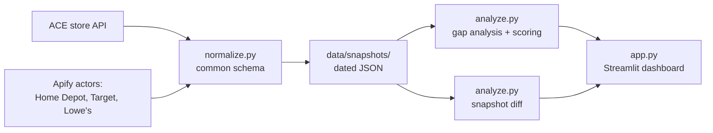

# ShelfSpace

Competitive shelf intelligence for a local hardware store: see what Home Depot, Target, and Lowe's are selling that you aren't — and what changed since last month.

**🏆 1st Place — ACE Hardware x Apify Hackathon**

A neighborhood ACE store (Jerry's Ace Hardware #17892, Denver) has no visibility into competitor assortment or pricing — big-box chains adjust both constantly, and the store owner finds out when customers stop coming in for paint. ShelfSpace scrapes the big-box catalogs on a schedule, lines them up against Jerry's actual catalog, and turns the difference into a ranked "stock this next" list plus a month-over-month change report, all in a Streamlit dashboard.

## What it does

- **Scrapes four sources per run** — Jerry's own ACE catalog via the acehardware.com search API (store-scoped), plus Home Depot, Target, and Lowe's via Apify actors (`rigelbytes/homedepot-scraper`, `automation-lab/target-scraper`, and `automation-lab/google-shopping-scraper` filtered to Lowe's).
- **Gap analysis** — normalizes everything to one product schema, resolves brand aliases (Rust-Oleum vs "rustoleum", etc.), and flags competitor products from brands Jerry's doesn't carry.
- **Ranked recommendations** — scores each gap on bestseller badges, ratings, review volume, and how many competitors carry it; merges duplicates across stores.
- **Month-over-month diffs** — each run is a dated snapshot in `data/snapshots/`; consecutive snapshots are diffed into new items, removed items, and price moves of 5%+ (`data/diffs/`).
- **Dashboard** — five tabs (Jerry's Inventory, Gaps & Recommendations, Competitor Catalog, Changes, Scraped Data), category/competitor filters, snapshot-version switcher, and a PDF export of the recommendations for the store owner.
- **Cost guardrails** — a per-run Apify budget (default $5): run costs are tracked live and actors are aborted mid-run if spend or item limits are exceeded. The Home Depot actor gets retried up to 3x because Akamai bot protection makes it flaky.

## How it works



`run_snapshot.py` is the pipeline entrypoint: it runs the Target and Lowe's actors as single batched calls and Home Depot as a category browse, all in parallel threads, normalizes the results, saves the day's snapshot, prints ranked recommendations, and diffs against the previous snapshot if one exists. The dashboard reads the snapshot files — and can also re-run the whole pipeline from a sidebar button with your chosen budget and product cap.

There's also an alternate collector, `scrape_all.py`, which pulls the same categories through SerpAPI (Google Shopping + Home Depot native engine) and Target's Redsky API directly — useful when the Apify actors are being fought off by bot protection.

## Tech stack

- **Python** — stdlib `urllib` for the direct store APIs, `ThreadPoolExecutor` for parallel scraping
- **Apify** (`apify-client`) — competitor catalog actors, residential proxies
- **Streamlit** — dashboard, with custom CSS and a light theme
- **ReportLab** — PDF export of recommendations
- **SerpAPI** — optional fallback data source
- No database: snapshots are plain dated JSON files, which is exactly enough for a monthly diff

## Run it locally

```bash
pip install -r requirements.txt

# .env (gitignored) — keys are read via python-dotenv, never hardcoded
APIFY_TOKEN=...        # required for Home Depot / Target / Lowe's scraping
TARGET_REDSKY_KEY=...  # required by scrape_all.py's direct Target Redsky calls
SERPAPI_KEY=...        # optional, only for the scrape_all.py fallback path

# take a snapshot (scrapes everything, ~2 min, capped at $5 of Apify spend)
python run_snapshot.py --categories paint --max-results 400 --budget 5

# launch the dashboard
streamlit run app.py
```

The repo ships with two real snapshots in `data/snapshots/` and one diff in `data/diffs/`, so the dashboard works out of the box without any keys — you only need them to scrape fresh data. (Heads up: the app's internal codename is **MysteryScraper** — that's the wordmark you'll see in the dashboard.)

## Built at

ACE Hardware x Apify Hackathon — built for a real store (Jerry's Ace Hardware, 2101 N Humboldt St, Denver) with real catalog data. First place.
